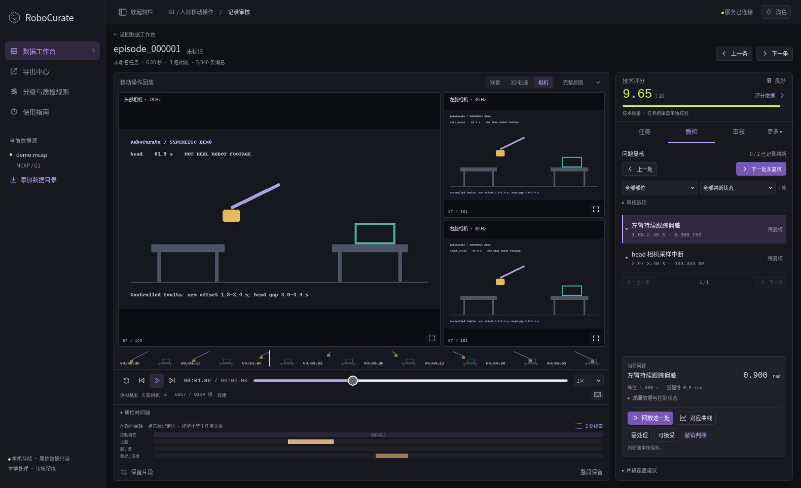

# RoboCurate

A local workbench for robot demonstrations: synchronized cameras and motion, explainable data quality, task-stage evidence, and traceable human decisions.

[中文说明](README.zh-CN.md) · [Models](docs/MODELS.md) · [Third-party notices](THIRD_PARTY_NOTICES.md)

**Source preview.** This repository provides source code and a synthetic demo. The supplied base-viewer's license is still under review; no repository-wide open-source license has been applied. See [license status and the exact file list](LICENSE_STATUS.md).

## Download

- [Download the v0.1.0-preview.2 source package](https://github.com/Lee-hz/RoboCurate/releases/download/v0.1.0-preview.2/RoboCurate-v0.1.0-preview.2-source.zip), or open [Releases](https://github.com/Lee-hz/RoboCurate/releases) and select the ZIP under **Assets**.
- For the latest source, choose **Code → Download ZIP** on the repository page, or [download main](https://github.com/Lee-hz/RoboCurate/archive/refs/heads/main.zip).

Extract the ZIP and follow the instructions below. This is a source distribution for local setup, not a standalone installer. Recordings and model weights are not bundled.

## Interface

The actual RoboCurate workspace reviewing a G1 banana-transfer recording: synchronized camera views, robot-state playback, a ten-point technical score and task-stage evidence from the installed `g1-stage-v3` model. These are direct application screenshots. The recording and model checkpoint used for the screenshots are not bundled.


The purple ghosts show three measured poses from the preceding five seconds. The cyan overlay shows the recorded control-target pose; dashed curves show target trajectories.

<details>
<summary>Pose ghosts, target comparison and camera detail</summary>


</details>

## Features

- Review native ROS 2 MCAP recordings using synchronized camera frames, G1 motion and joint curves.
- Three primary views: **Task**, **Quality checks**, and **Review**. Advanced curves and raw channels are under **More**.
- Technical quality on a **0–10 scale**, with measured dimensions and auditable weights. Grade gates remain independent.
- With an installed stage model, navigate five task phases, inspect probabilities and missing inputs, and replay uncertain segments.
- Save human decisions and selected ranges; export a manifest or a generic NPZ/JPEG training bundle with timestamps and validity masks.
- Optionally use the separate WARP relative-progress model for action-chunk weights.

The UI is currently Chinese. The data adapter targets G1 recordings with 29 body joints, two six-dimensional hands and up to three cameras. It does not automatically support arbitrary robot layouts. Stage predictions and technical scores do not certify task success.

## Run locally

Requirements: Python 3.10+, a browser, and Python virtual-environment support. Linux is the platform tested in development. ROS itself is not required.

From the extracted source directory:

```bash
./start.sh
```

The script creates `.venv` and installs application dependencies on first run. Open **http://127.0.0.1:8421/** and add a recording directory. Alternatively:

```bash
./start.sh /path/to/recordings
```

The server binds to loopback. It is intended for a local operator, not a public multi-user service. Recordings are read-only; caches, reviews and exports are stored in `workspace/`.

## Synthetic demo

No laboratory recording or model download is required:

```bash
python3 -m venv .venv
.venv/bin/python -m pip install -r requirements.txt
.venv/bin/python scripts/create_demo.py
./start.sh workspace/demo --workspace workspace/demo-session --analyze
```

The six-second MCAP contains generated camera diagrams, 41-dimensional state/action data, a controlled arm offset and a deliberate head-camera gap. Every image is labelled **SYNTHETIC DEMO**. It exercises playback, technical checks, review and export; it is not a visual-model benchmark and has no success label.

<details>
<summary>View the synthetic sample used for trying the interface without recordings</summary>



</details>

Task-stage and WARP inference require appropriate checkpoints in a separate model environment. The source candidate includes their implementation, not pretrained weights or private recordings. See [model setup](docs/MODELS.md).

## Scores and exports

`quality.rating.max_score` is `10`, and rating schema version is `3`. The previous 100-point score is divided by ten: `92.3 → 9.23`. Dimensions, weighted contributions, the catalog and new exports use the same scale. Coverage and model probabilities remain percentages; WARP retains its relative-speed unit.

Exports retain `robot-data-studio.v1` for reader compatibility. Training bundles contain 41-dimensional state/action arrays, JPEG images, timestamps and validity masks. This is a generic format, not native LeRobot/RLDS or an RGB-D conversion. `dataset_reader.py` provides a reader.

## Development

```bash
.venv/bin/python -m pip install -r requirements-dev.txt
PYTHONPATH=. .venv/bin/python -m pytest tests/test_demo.py tests/test_scoring.py tests/test_grading.py -q
node --test tests/*.test.mjs
```

Synthetic end-to-end tests generate MCAP, inspect known faults and export a reviewed clip. Full model tests require model dependencies. Historical integration tests are explicitly skipped when the private development recordings are absent; skips are not evidence of real-data evaluation.

See [contributing](CONTRIBUTING.md), [changes](CHANGELOG.md), [validation scope](docs/VALIDATION.md), [source packaging](docs/SOURCE_PACKAGE.md), [publication status](RELEASE_STATUS.json), and [security scope](SECURITY.md). Raw recordings, review databases, browser profiles, login caches and model weights do not belong in the source repository.
