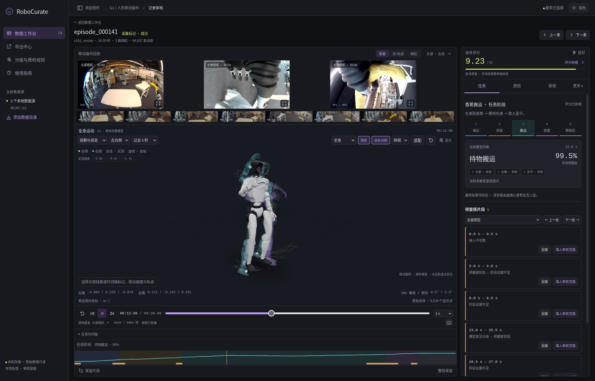
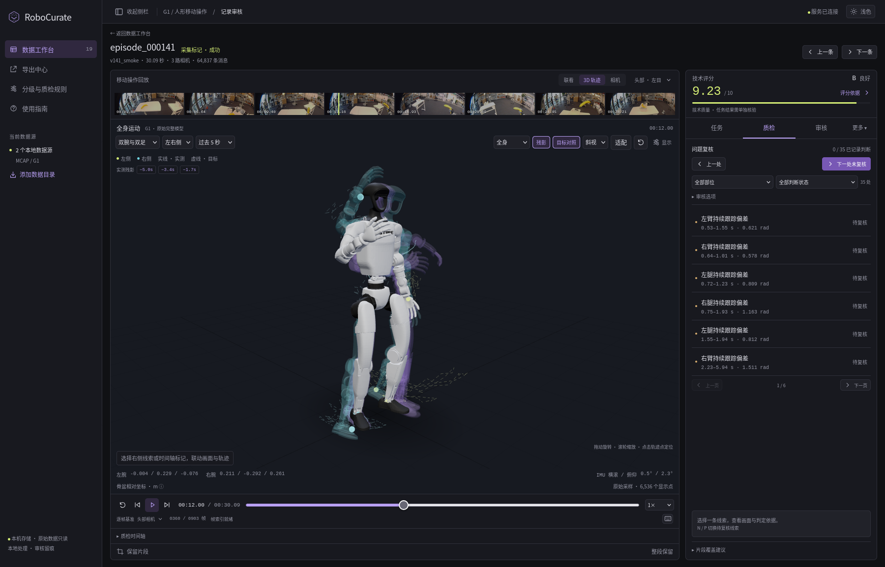
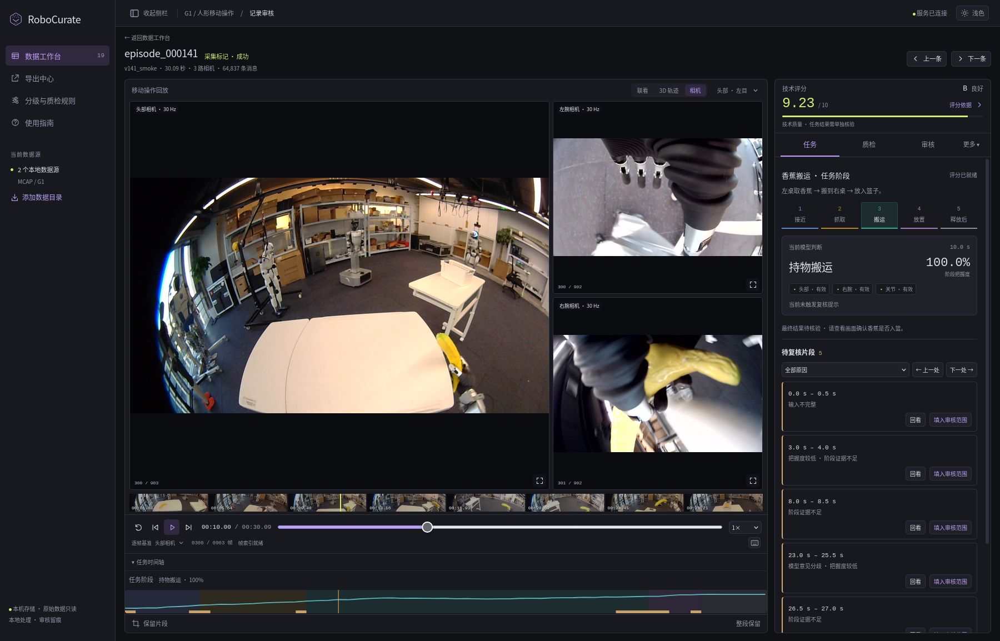

# RoboCurate · 机器人数据审核工作台

本地回放机器人录像和运动状态，结合技术质检、任务阶段模型及人工复核，整理可用训练片段。

**当前为源码预览版。** 最初提供的基础查看器源码授权仍待核实，尚未为整个项目设置统一的开源许可证；[许可证状态](LICENSE_STATUS.md) 列出了具体文件和现有第三方许可。

## 下载项目

- **固定版本**：[下载 v0.1.0-preview.3 源码包](https://github.com/Lee-hz/RoboCurate/releases/download/v0.1.0-preview.3/RoboCurate-v0.1.0-preview.3-source.zip)，也可在 [Releases 页面](https://github.com/Lee-hz/RoboCurate/releases) 的 **Assets** 中下载。
- **最新源码**：项目首页点击 **Code → Download ZIP**，或[直接下载 main 分支](https://github.com/Lee-hz/RoboCurate/archive/refs/heads/main.zip)。

下载后解压，按下方说明启动。这是需要安装依赖的源码包，不是双击安装程序；源码包不附带录像；配套权重已发布，按下方“安装现有模型”下载即可。首页 **Code → Download ZIP** 下载的源码也能使用同一安装命令。

## 实际界面

下图直接截取自当前 RoboCurate，使用 G1 搬运香蕉的真实录像与已安装的 `g1-stage-v3` 模型，展示三路相机、机器人三维回放、10 分制技术评分和任务阶段判断。截图对应的录像保留在本地；所用的同一套模型权重已提供下载。



紫色残影为过去 5 秒中的三个实测姿态，青色叠加模型为录制的控制目标姿态，虚线为目标轨迹。

<details>
<summary>查看更多：姿态残影、目标对照与相机细节</summary>





</details>

## 开始使用

需要 Python 3.10+ 和浏览器，当前实测平台为 Linux，无需安装 ROS。

```bash
./start.sh /你的录制目录
```

首次运行会创建 `.venv` 并安装依赖。打开 http://127.0.0.1:8421/。不传目录时可在界面点击“添加数据目录”；原始 MCAP 只读，缓存、审核与导出保存在 `workspace/`。

默认监听 `0.0.0.0`，同一局域网内的其他电脑可通过启动时打印的地址访问。本应用没有身份验证，并会读取操作者指定的本机路径，因此仅限可信局域网使用，切勿暴露到公网。若只想本机访问：

```bash
./start.sh --local
```

也可用 `--host` 或 `ROBOCURATE_HOST` 指定监听地址，用 `--port` 或 `ROBOCURATE_PORT` 改端口。

没有录像时可运行合成演示：

```bash
python3 -m venv .venv
.venv/bin/python -m pip install -r requirements.txt
.venv/bin/python scripts/create_demo.py
./start.sh workspace/demo --workspace workspace/demo-session --analyze
```

演示为程序生成的六秒数据，包含三路带“合成”标识的图像、身体和双手状态、动作目标以及两个已知异常。它用于试用与接口测试，不是真实机器人录像，也不能证明视觉模型效果。

## 安装现有模型

在解压后的源码目录执行（约 94 MB，无需 GitHub 或 Hugging Face 登录）：

```bash
python3 -m venv workspace/warp-env
workspace/warp-env/bin/python -m pip install torch==2.8.0 --index-url https://download.pytorch.org/whl/cpu
workspace/warp-env/bin/python -m pip install -r requirements-warp.txt
python3 scripts/install_models.py
workspace/warp-env/bin/python scripts/verify_models.py
```

包含 DINOv2-S/14 图像骨干、G1 阶段模型 v1/v2/v3 和公开视频 WARP 时序模型。启动或刷新项目，在任务面板选择 **g1-stage-v3** 即可分析相同任务的 G1 录像。模型验证命令检查权重和推理能否运行，不代表新场景准确率。

也可先[用浏览器下载权重包](https://github.com/Lee-hz/RoboCurate/releases/download/v0.1.0-preview.3/RoboCurate-v0.1.0-preview.3-models.zip)，再按[离线安装说明](docs/MODELS.md)安装。[训练代码与复算条件](docs/TRAINING.md)说明如何继续研究。

## 精简后的操作

- **任务**：五阶段导航、当前模型判断和待复核片段。点击“回看”会播放片段及前后各一秒；“填入审核范围”只填写草稿，加入并保存后才记录。
- **质检**：查看技术异常、定位证据、记录需要处理或可以接受的情况。时间轴随任务/质检切换，同一时刻只显示相关分析。
- **审核**：填写任务指令、处理结论和备注，保存或保存并进入下一条。
- **更多**：需要时查看关节曲线和原始通道。技术分旁的“评分依据”是分项解释的统一入口。

任务面板中的完整概率、输入覆盖、模型依据和分析设置按需展开；阶段模型与 WARP 通过同一个模型选择器切换，不重复显示曲线。

## 10 分制

技术总分、分项、加权贡献、列表和新导出统一使用 0–10 分，例如 `92.3/100 → 9.23/10`。接口增加 `max_score: 10`，评分数据版本为 3，计算方法和权重仍为原来的方案。A–D 数据等级按原门槛评估，不根据新显示分数重新划线。

覆盖率和模型分类概率继续用百分比；WARP 继续使用相对速度。高技术分、高阶段把握度和“释放后观察”都不能直接认定香蕉已经入篮。

## 模型与数据范围

当前数据映射针对 G1 的 29 个身体关节、双手各 6 维及三路相机，不能自动支持任意机器人。已有阶段模型采用 DINOv2 视觉特征、关节状态及变化量、时序网络；详见 [模型说明](docs/MODELS.md)。配套权重包包含现有模型，全部训练与研究代码已补入 `research/`；训练录像和标注不公开。未安装模型时可使用技术质检与人工审核。

导出是通用 NPZ/JPEG/JSON 包，保留 `robot-data-studio.v1` 协议标识及现有读取器兼容性。详情、开发测试和限制见 [英文 README](README.md)。

## 项目贡献者

- [wangyian123](https://github.com/wangyian123)

详见[贡献者名单](CONTRIBUTORS.md)。
